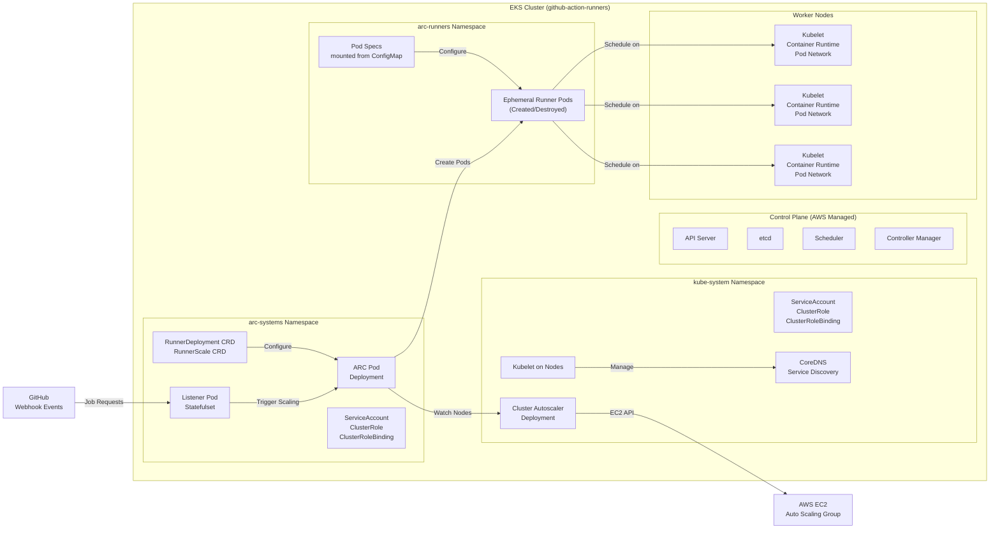
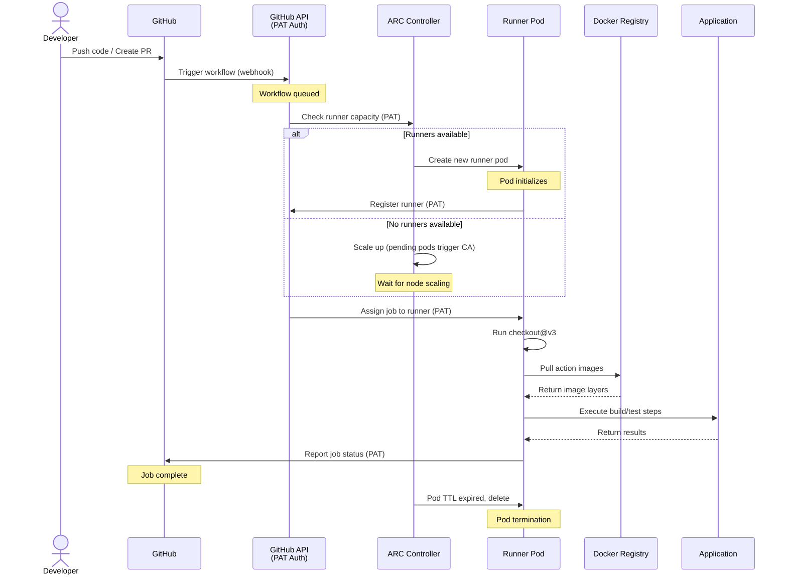
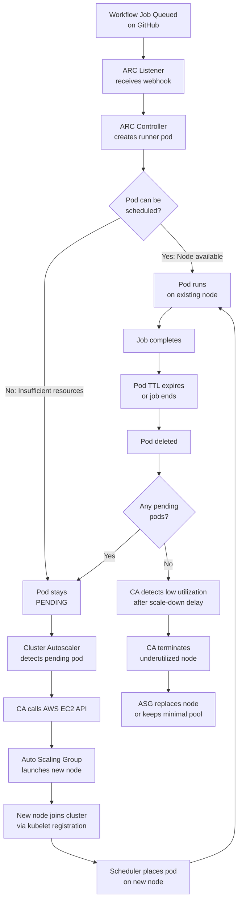
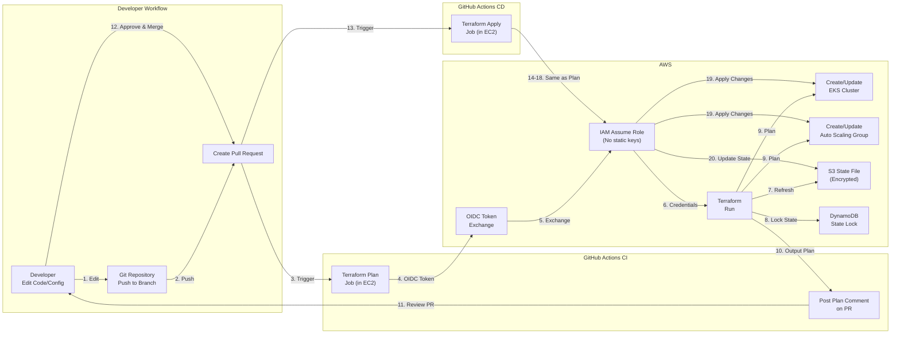
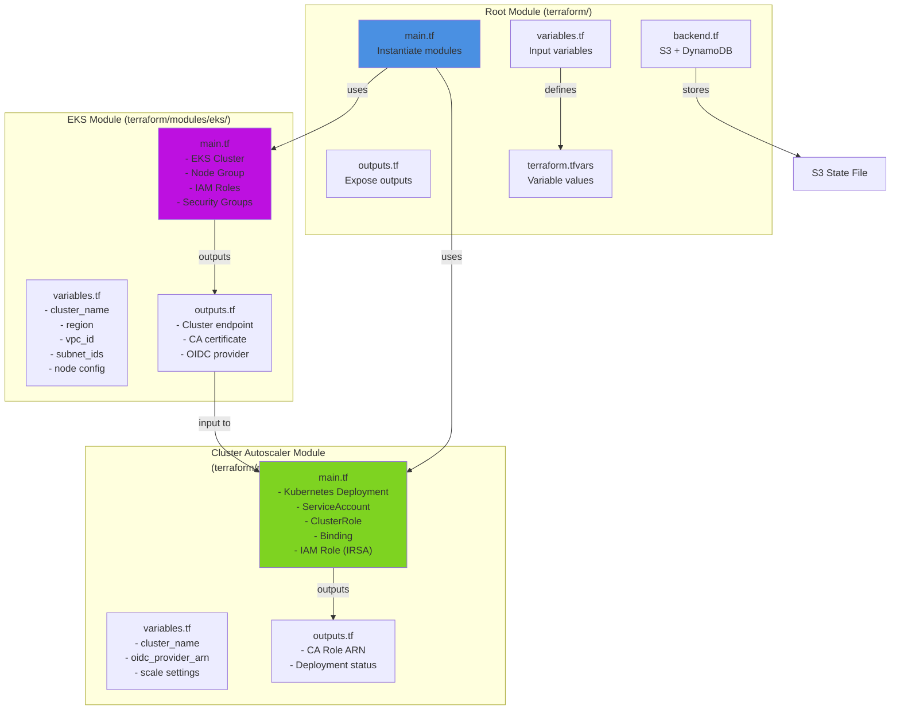
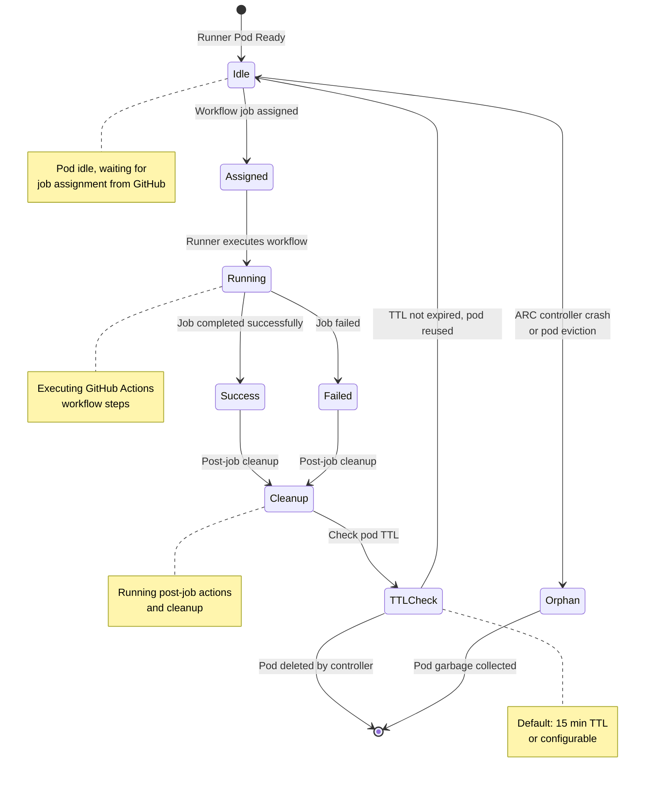
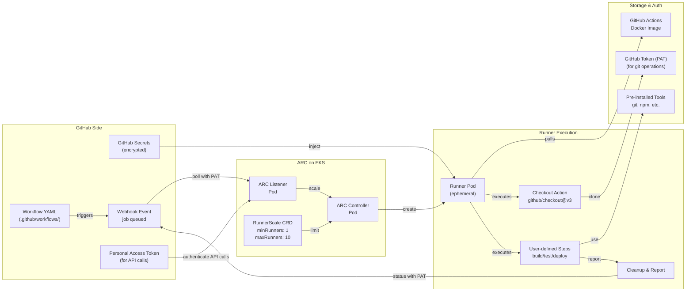
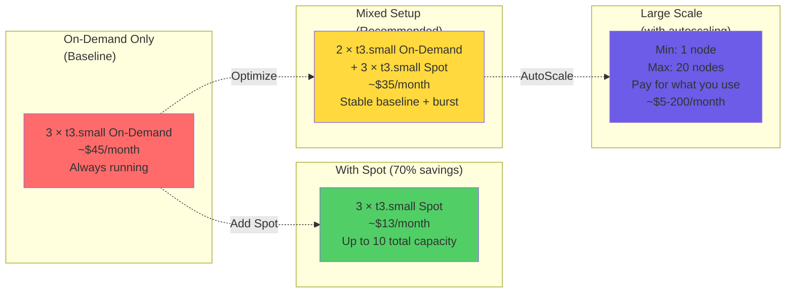
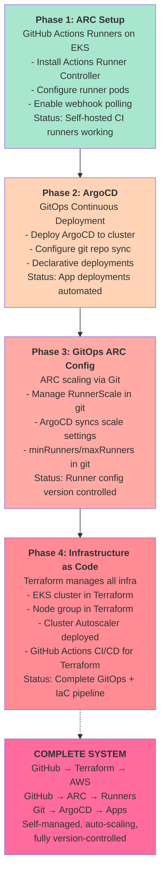
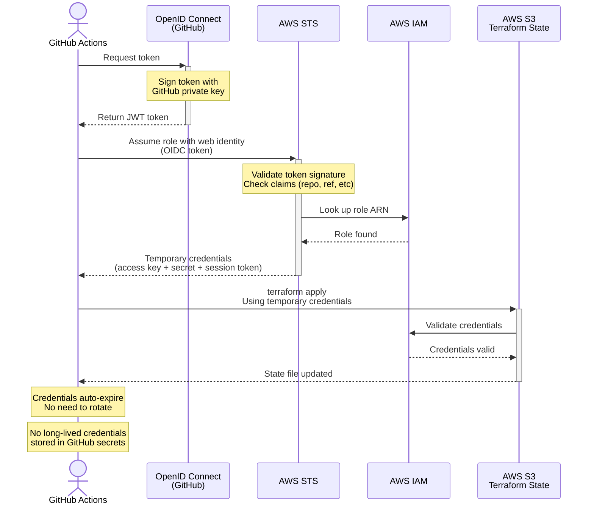

# GitHub Actions EKS Runners - Comprehensive Architecture Diagrams

This document contains visual diagrams of the complete GitHub Actions EKS Runners infrastructure and deployment architecture.

---

## 1. Overall System Architecture

High-level overview of how all components interact:

```mermaid
graph TB
    subgraph "GitHub"
        GH["GitHub Repository<br/>with Workflows"]
    end
    
    subgraph "AWS Cloud"
        subgraph "VPC"
            EKS["EKS Control Plane<br/>(Managed by AWS)"]
            SG["Security Group"]
            
            subgraph "Worker Nodes<br/>(t3.small)"
                Node1["Node 1<br/>2vCPU, 2GB RAM"]
                Node2["Node 2<br/>2vCPU, 2GB RAM"]
                Node3["Node 3<br/>2vCPU, 2GB RAM"]
            end
            
            subgraph "Kubernetes Namespaces"
                subgraph "arc-systems"
                    ARC["Actions Runner<br/>Controller Pod"]
                    Listener["Listener Pod"]
                end
                
                subgraph "arc-runners"
                    Runner1["Runner Pod"]
                    Runner2["Runner Pod"]
                    RunnerN["... Runner Pods"]
                end
                
                subgraph "kube-system"
                    CA["Cluster Autoscaler"]
                    DNS["CoreDNS"]
                end
            end
        end
        
        IAM["IAM Roles<br/>(OIDC)"]
        S3["S3 Backend<br/>(Terraform State)"]
    end
    
    subgraph "External Services"
        ArgoCD["ArgoCD<br/>(GitOps)"]
        Docker["Docker Registry"]
    end
    
    GH -->|Webhook Event (PAT Auth)| Listener
    GH -->|Job Status Updates (PAT Auth)| ARC
    ARC -->|Create/Manage| Runner1
    ARC -->|Create/Manage| Runner2
    ARC -->|Create/Manage| RunnerN
    Runner1 -->|Report Status (PAT Auth)| GH
    EKS -->|Manages| Node1
    EKS -->|Manages| Node2
    EKS -->|Manages| Node3
    CA -->|Auto-scales| Node1
    CA -->|Auto-scales| Node2
    CA -->|Auto-scales| Node3
    ArgoCD -->|Deploy| ARC
    Docker -->|Pull Images| Runner1
    IAM -->|IRSA| CA
    S3 -->|State| IAM
```

---

## 2. Kubernetes Cluster Architecture

Detailed view of the Kubernetes cluster internals:



---

## 3. CI/CD Pipeline Workflow

The workflow of how GitHub Actions jobs are processed:



---

## 4. Cluster Autoscaling Flow

How the cluster automatically scales based on workload:



---

## 5. Infrastructure as Code (Terraform) Deployment

Flow of Terraform applying infrastructure changes:



---

## 6. Terraform Module Architecture

Modular organization of Terraform code:



---

## 7. GitHub Actions Runner Lifecycle

Complete lifecycle of a runner from creation to termination:



---

## 8. Data Flow: Job Execution

How data flows from GitHub to runner execution and back:



---

## 9. Network Architecture

How network traffic flows through the system:

```mermaid
graph TB
    subgraph "GitHub.com"
        GHServers["GitHub Servers<br/>Webhook endpoint"]
    end
    
    subgraph "Internet"
        Internet["Public Internet<br/>HTTPS"]
    end
    
    subgraph "AWS VPC (10.0.0.0/16)"
        subgraph "Public Subnets"
            IGW["Internet Gateway"]
            NatGW["NAT Gateway"]
            LB["Network Load Balancer<br/>(optional)"]
        end
        
        subgraph "Private Subnets (EKS Nodes)"
            SG["Security Group<br/>Allow: 443 ingress<br/>Allow: Kubelet 10250"]
            Node1_Net["Node 1<br/>10.0.1.x"]
            Node2_Net["Node 2<br/>10.0.2.x"]
            Node3_Net["Node 3<br/>10.0.3.x"]
        end
        
        subgraph "Pod Network (172.17.0.0/16)"
            Pods["Pods within cluster<br/>communicate via CNI"]
        end
    end
    
    GHServers -->|HTTPS Webhook| Internet
    Internet -->|443| IGW
    IGW -->|NAT| NatGW
    NatGW -->|Route| Node1_Net
    NatGW -->|Route| Node2_Net
    NatGW -->|Route| Node3_Net
    Node1_Net -->|Kube API| Pods
    Node2_Net -->|Kube API| Pods
    Node3_Net -->|Kube API| Pods
    Pods -->|Pod-to-Pod| Pods
    Node1_Net -->|Pull Images| Internet
```

---

## 10. Cost and Scaling Scenarios

Different cost scenarios based on configuration:



---

## 11. Deployment Phases

The four-phase buildout of the complete system:



---

## 12. OIDC Authentication Flow (Terraform to AWS)

How Terraform authenticates to AWS without storing credentials:



---

## Summary

This project implements a **complete, production-ready GitOps pipeline** with:

1. **Self-hosted CI** - GitHub Actions runners on EKS (ARC)
2. **Automatic Scaling** - Cluster Autoscaler responds to workload
3. **GitOps CD** - ArgoCD syncs from Git
4. **Infrastructure as Code** - Terraform manages all AWS resources
5. **Zero Secrets** - OIDC authentication eliminates credential rotation
6. **Cost Optimization** - Spot instances, auto-scaling, and cleanup

**Key Technologies:**
- **GitHub Actions Runner Controller (ARC)** - Kubernetes-native runner management
- **Amazon EKS** - Managed Kubernetes on AWS
- **Cluster Autoscaler** - Automatic node scaling
- **ArgoCD** - Declarative GitOps deployment
- **Terraform** - Infrastructure as Code
- **AWS OIDC** - Keyless authentication

All components work together to create a self-healing, scalable CI/CD infrastructure that tracks all changes in Git.
